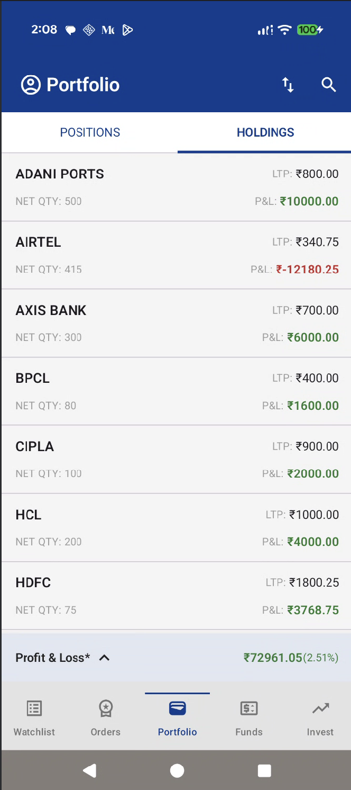
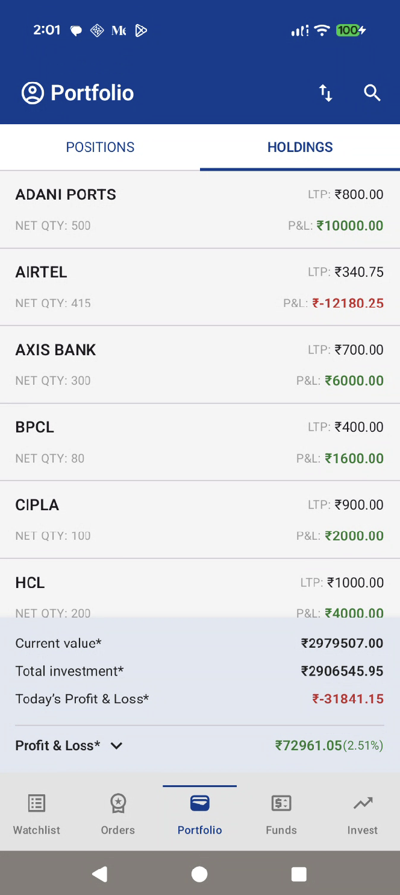

# Portfolio Holdings App

A small stocks portfolio demo app that shows a user's holdings, summary profit and loss, and supports offline-first behavior using a local cache.

---

## Screenshots





## Tech Stack

**UI**

- Jetpack Compose
- Material 3 components

**Architecture**
- MVVM with Clean Architecture
- ViewModel from AndroidX lifecycle
- Use cases for domain logic
- Repository abstraction for data access

**Data and networking**

- Retrofit for HTTP calls
- Kotlinx Serialization for JSON
- Room for local persistence
- Paging 3 for paginated data
- WorkManager for periodic background sync
- Custom `NetworkMonitor` to detect connectivity

**Dependency Injection**

- Dagger Hilt for DI
- Hilt integration with WorkManager and ViewModel

**Coroutines and flows**

- Kotlin Coroutines
- Kotlin Flow and StateFlow

---


## Project Structure

```text
app/
 └── src/main/
     ├── java/com/krai29/karanbalakrishnaraitask/
     │   ├── core/                   # DomainResult, NetworkMonitor
     │   ├── data/
     │   │   ├── local/              # Room DB, Dao, Entity
     │   │   ├── remote/             # Retrofit API, DTOs
     │   │   └── repository/         # HoldingsRepositoryImpl
     │   ├── domain/
     │   │   ├── model/              # Holding, PortfolioSummary
     │   │   ├── repository/         # HoldingsRepository interface
     │   │   └── usecase/            # Observe*, Refresh* use cases
     │   ├── di/                     # Hilt modules
     │   ├── presentation/
     │   │   ├── model/              # UI models, UI state
     │   │   ├── ui/
     │   │   │   ├── activity/       # StocksActivity
     │   │   │   ├── components/     # Compose reusable components
     │   │   │   ├── screens/        # StocksScaffold and screen UI
     │   │   │   └── theme/          # Compose theme, colors, typography
     │   │   └── viewmodel/          # PortfolioViewModel
     │   ├── util/                   # PnlCalculator
     │   └── worker/                 # PortfolioSyncWorker
     └── res/
         ├── layout/                 # (if any XML remains)
         ├── values/                 # strings, themes, colors
         └── mipmap/                 # app icons
